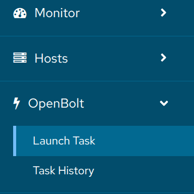
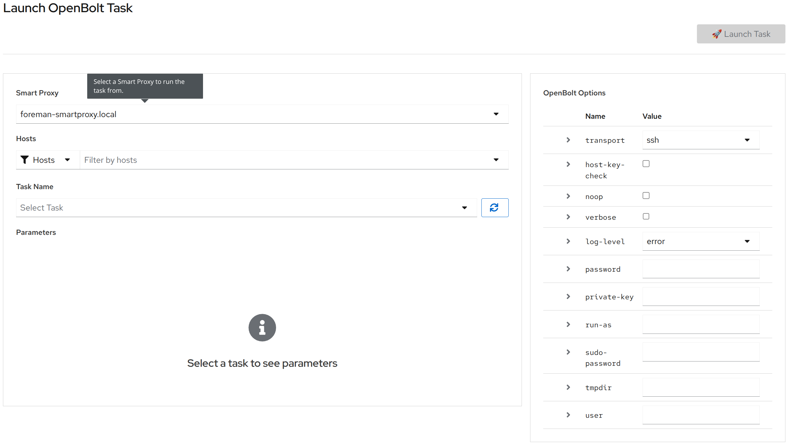
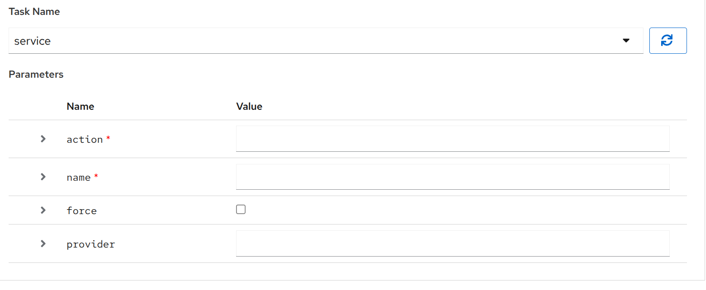
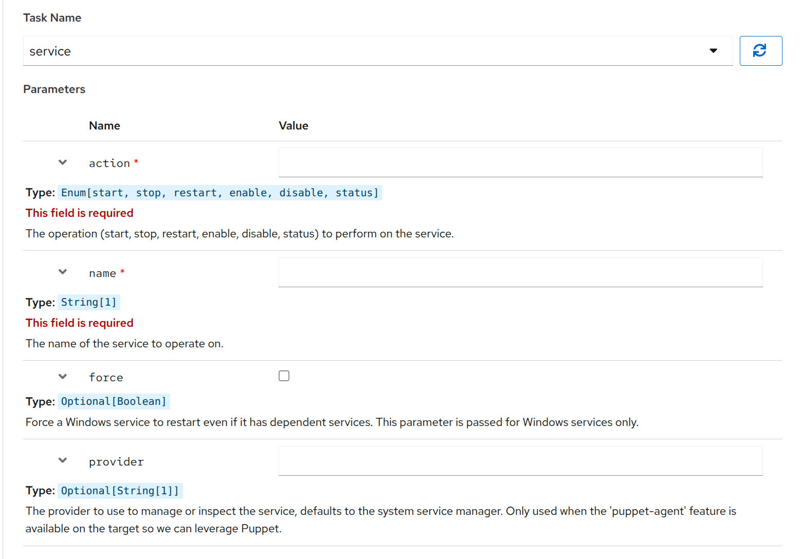
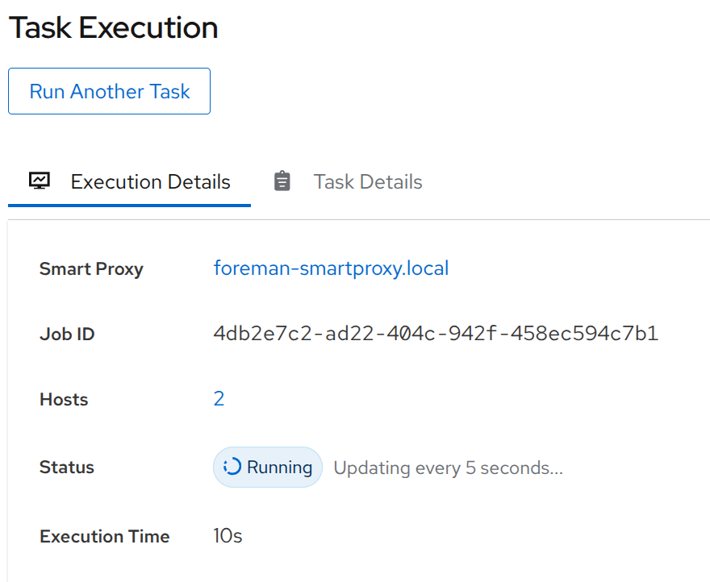
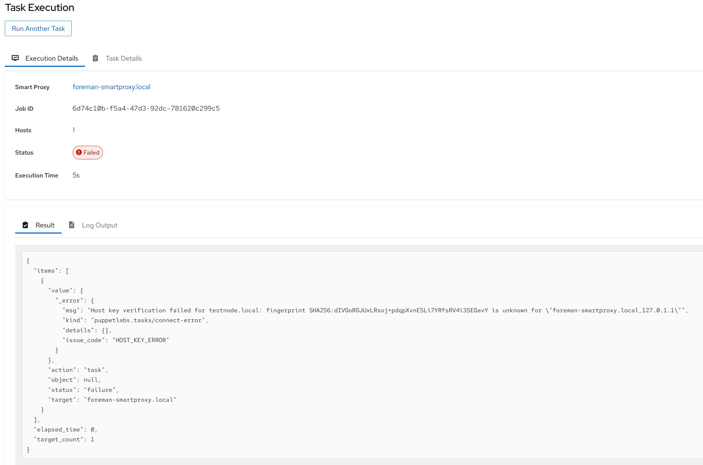
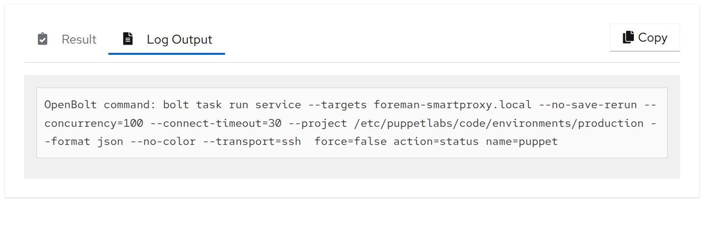
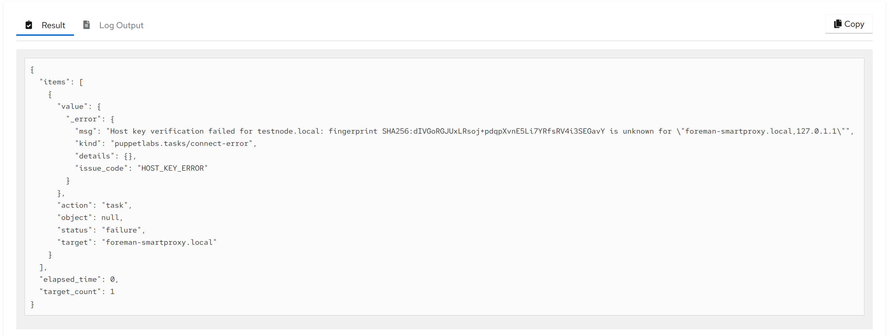
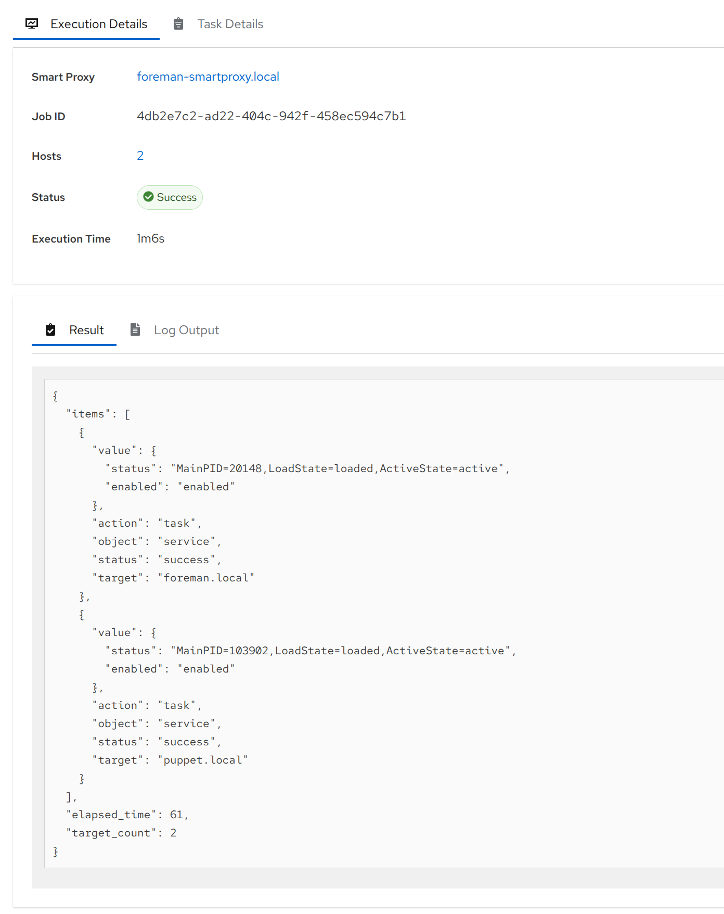

# foreman-openbolt

Bringing OpenBolt Task & Plans into Foreman!

## Introduction

[OpenBolt](https://github.com/OpenVoxProject/openbolt) is the open source successor of [bolt](https://github.com/puppetlabs/bolt) by [Perforce](https://www.perforce.com/).
OpenBolt supports running Tasks or Plans against various targets / via different transport protocols.
OpenBolt and Bolt are CLI-only tools.
They connect to the targets from a central location (usually a jumpnode or workstation).

## Tasks

Tasks are little executeable things, like binaries or scripts.
They are enhanced with a metadata file, which describes input and output parameters.
A task is copied to N targets and executed there.

## Plans

Plans provide complex logic options, written in Puppet DSL.
Besides the usual Puppet DSL functions, it's also possible to execute tasks and evaluate their responses.

## OpenBolt in Foreman!

OpenBolt is the Ansible counterpart and OpenBolt is Puppet "native".
OpenBolt and Puppet integrate very well together and OpenBolt can reuse your existing Puppet code.
Since OpenBolt is a CLI only application, and most Puppet users run Foreman anyways, it made sense to integrate OpenBolt into Foreman, instead of writing another web UI.

## Installation

The installation is split into four parts:

* Foreman Plugin
* Foreman Smartproxy Plugin
* OpenBolt
* Code Deployment

See [How_to_Install_a_Plugin](https://theforeman.org/plugins/#2.Installation) for how to install Foreman plugins.
The [theforeman/foreman](https://github.com/theforeman/puppet-foreman/blob/master/manifests/plugin/openbolt.pp) puppet module also supports the **Foreman plugin** installation.
The [theforeman/foreman_proxy](https://github.com/theforeman/puppet-foreman_proxy/blob/master/manifests/plugin/openbolt.pp) puppet module also supports the **Foreman Smartproxy plugin** installation.

**as of 2025-12-15 integration into the foreman installer is still pending**

The Foreman plugin provides UI elements to start Tasks on various nodes.
Foreman then talks to a Smartproxy to run OpenBolt.
The Smartproxy also establishes the connections to the various targets.
This is usually a ssh or WinRM connection (and soon choria, see [the TODO section](#todo).

You need to have `bolt` in your `$PATH` on the Smartproxy.
You can use the legacy bolt packages from Perforce from the `puppet-tools` repo on [apt.puppet.com](https://apt.puppet.com/) or [yum.puppet.com](https://yum.puppet.com/).
If you have an active Perforce license, you can also download [their commercial bolt version](https://help.puppet.com/bolt/current/topics/bolt_installing.htm).
OpenBolt packages are available at [yum.voxpupuli.org](https://yum.voxpupuli.org/) & [apt.voxpupuli.org](https://apt.voxpupuli.org/) in the openvox8 repo.

**The Foreman integration is tested with OpenBolt and the last Bolt opensource release 4.0.0**

The integration is supported on Foreman 3.15 and all following versions, including development/nightly builds.

OpenBolt relies on Tasks & Plans. They are distributed as puppet modules.
The plugin assumes that you deployed your code.
We recommend to use [r10k](https://github.com/puppetlabs/r10k?tab=readme-ov-file#r10k) or [g10k](https://github.com/xorpaul/g10k?tab=readme-ov-file#g10k) to deploy code, as you do it on your compilers.

A handful of core/default Tasks & Plans are also included in the [OpenBolt rpm/deb packages](https://github.com/OpenVoxProject/openbolt/blob/main/Puppetfile).

## Usage

(all screenshots were taken on Foreman 3.17)

After installation, you will see a new UI element

The "Launch Task" option allows you to select any smartproxy with the `openbolt` feature (which is available when the OpenBolt Smartproxy plugin is installed).
Afterwards you can select N targets to run the task and select an available task from the selected Smartproxy.
On the right side you can configure OpenBolt connection settings.

After selecting a task, the task metadata is fetched and shown.
Additional input elements will appear, if the task support it.

The metadata can contains a description and datatypes for tasks.
Those information can be shown as well.

While the task is running, the UI polls the status from the smart proxy.

After the task finished, it will display a success for failure page.

You can also see the used parameters for a task.

We also display the used OpenBolt command line, in case you want to manually run it or debug it.

OpenBolt returns JSON for executed tasks.
That's visible in the UI.
For failed tasks but also for passed tasks.

## TODO

* Integrate plans into the web UI
* provide a choria transport plugin

## Contributing & support

Fork and send a Pull Request. Thanks!
If you have questions or need professional support, please join the `#sig-orchestrator` channel on the [Vox Pupuli slack](https://voxpupuli.org/connect/).

## Copyright

Copyright (c) *2025* *Overlook InfraTech*

Copyright (c) *2025* *betadots GmbH*

This program is free software: you can redistribute it and/or modify
it under the terms of the GNU General Public License as published by
the Free Software Foundation, either version 3 of the License, or
(at your option) any later version.

This program is distributed in the hope that it will be useful,
but WITHOUT ANY WARRANTY; without even the implied warranty of
MERCHANTABILITY or FITNESS FOR A PARTICULAR PURPOSE.  See the
GNU General Public License for more details.

You should have received a copy of the GNU General Public License
along with this program.  If not, see <http://www.gnu.org/licenses/>.

## how to release

* bump version in `lib/foreman_openbolt/version.rb` and `package.json`
* run `CHANGELOG_GITHUB_TOKEN=github_pat... bundle exec rake changelog`
* create a PR
* get a review & merge
* create and push a tag
* github actions will publish the tag

The Foreman team packages this gem as Debian package (deb) and as RedHat package (rpm).
They have a bot that will automatically propose an rpm/deb update at [github.com/theforeman/foreman-packaging](https://github.com/theforeman/foreman-packaging/pulls).
